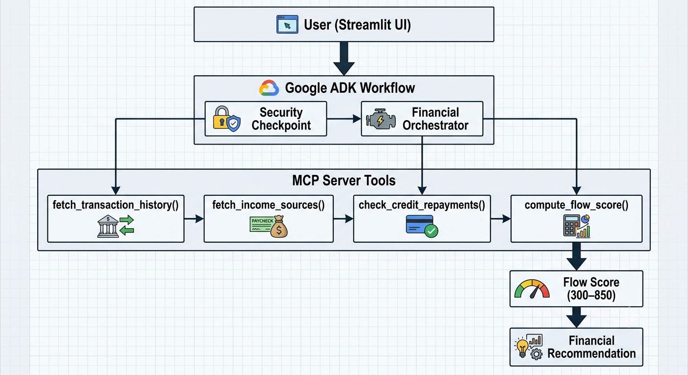
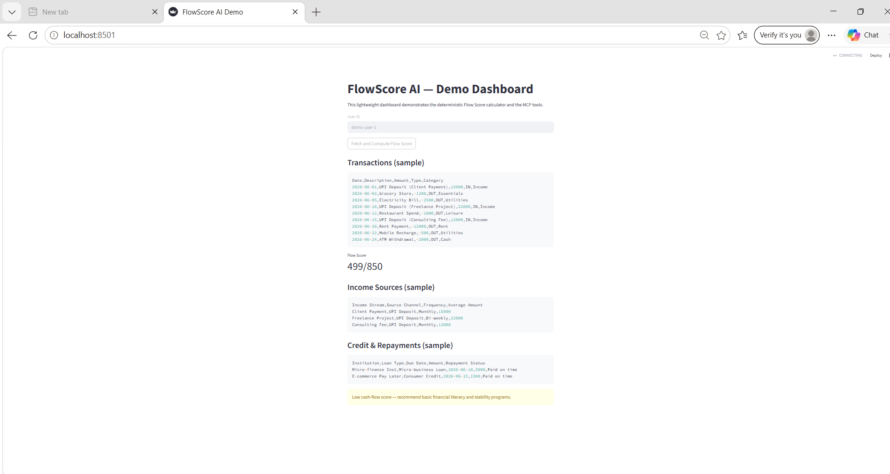

# FlowScore AI

AI-powered alternative credit scoring for gig workers, freelancers, and underserved individuals using cash-flow analysis instead of traditional credit history.



## Problem Statement

Millions of freelancers, gig workers, and self-employed individuals struggle to access loans because they lack formal credit histories. Traditional credit scoring systems often fail to evaluate their actual financial stability.

## Solution

FlowScore AI analyzes transaction history, income patterns, spending behavior, and repayment records to generate a cash-flow-based credit score and risk assessment. This enables fairer financial inclusion for individuals outside conventional banking systems.

## Key Features

* Multi-Agent Architecture using Google ADK
* MCP Server integration for financial data access
* Cash-flow-based credit scoring
* Risk assessment and eligibility recommendations
* Streamlit dashboard for visualization
* Security validation layer for financial workflows

## Technology Stack

* Python
* Google ADK
* MCP (Model Context Protocol)
* Streamlit
* Gemini Models
* GitHub

## Architecture

1. Security Agent validates requests.
2. Financial Orchestrator coordinates analysis.
3. MCP Server fetches transaction and income data.
4. FlowScore Engine calculates credit score.
5. Dashboard displays score and recommendations.

## Dashboard Preview



## Demo

Run locally:

```bash
streamlit run app/streamlit_app.py
```

## Sample Output

*Flow Score: 499/850
*Recommendation: Low cash-flow score

## Why FlowScore AI?

Traditional credit scoring often excludes freelancers, gig workers, and self-employed individuals.

FlowScore AI focuses on actual cash-flow behavior rather than historical credit records, helping financial institutions evaluate underserved users more fairly and transparently.

## Future Enhancements

* Real bank statement integration
* UPI transaction ingestion
* Explainable AI scoring reports
* Loan recommendation engine
* Financial literacy assistant

## Project Structure

```text
flowscore-ai/
├── app/
├── tests/
├── deployment/
├── architecture.png
├── README.md
└── pyproject.toml
```

## Author

Dhana Laxmi
B.Tech CSE (AIML)
Neil Gogte Institute of Technology
